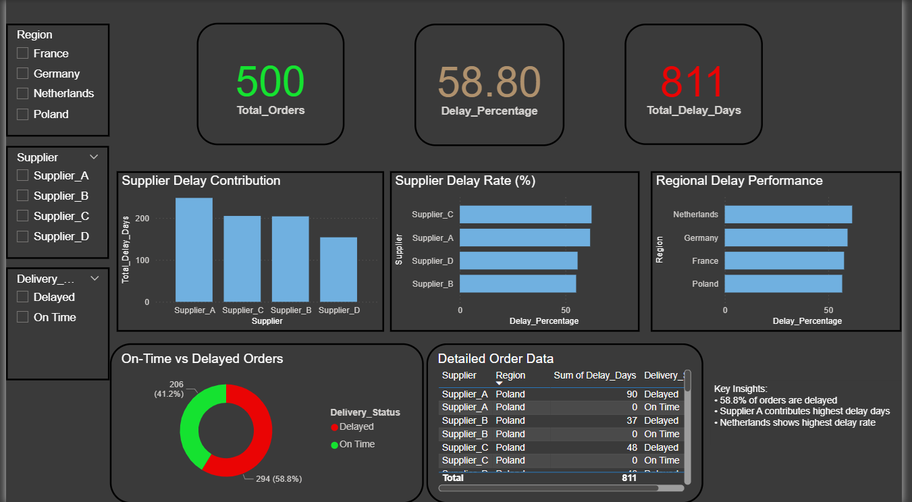

# 📦 Supply Chain Delay & Performance Analysis

## 📊 Project Overview

This project analyzes supply chain delays, supplier performance, and operational efficiency using SQL and Power BI.
## 📊 Dashboard Preview

## 🎯 Objective

* Identify delivery delays
* Analyze supplier performance
* Evaluate regional efficiency
* Support process optimization decisions

---

## 🛠 Tools Used

* SQL (SQLite)
* Power BI
* Excel (data preparation)

---

## 📷 Dashboard Preview

---

## 📈 Key Insights

* 58.8% of orders are delayed
* Supplier A contributes highest delay volume
* Netherlands has the highest delay rate
* Total delay days: 811 across 500 orders

---

## 📂 Project Structure

* `data/` → dataset files
* `sql/` → analysis queries
* `dashboard/` → Power BI file (.pbix)
* `images/` → dashboard screenshots

---

## 📊 Key Analysis Queries

* Delay % by Supplier
* Delay % by Region
* On-time vs Delayed Orders
* Total Delay Contribution

---

## 🚀 Business Impact

This analysis helps:

* Improve supplier selection
* Optimize delivery processes
* Reduce operational inefficiencies
* Support data-driven decision-making

---
